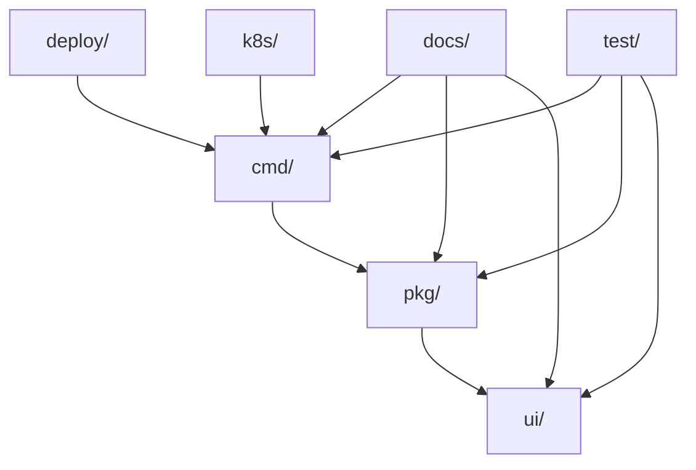

# 📁 项目目录结构总览

本文档详细说明了 CRDs Objects Browser 项目的目录结构和文件组织方式。

## 🏗️ 整体架构

```
crds-objects-browser/
├── 📁 cmd/                    # 🚀 应用程序入口
├── 📁 pkg/                    # 🔧 核心业务逻辑
├── 📁 ui/                     # 🎨 前端Vue应用
├── 📁 deploy/                 # 🚢 部署配置
├── 📁 k8s/                    # ☸️  Kubernetes清单
├── 📁 docs/                   # 📚 文档目录
├── 📁 test/                   # 🧪 测试目录
├── 📁 bin/                    # 📦 编译输出
├── 📄 README.md               # 项目说明
├── 📄 CHANGELOG.md            # 更新日志
├── 📄 CONTRIBUTING.md         # 贡献指南
├── 📄 LICENSE                 # 开源协议
├── 📄 Dockerfile              # Docker构建文件
├── 📄 Makefile                # 构建脚本
├── 📄 go.mod                  # Go模块定义
├── 📄 go.sum                  # Go依赖锁定
├── 📄 .gitignore              # Git忽略规则
└── 📄 VERSION                 # 版本信息
```

## 📂 详细目录说明

### 🚀 cmd/ - 应用程序入口
```
cmd/
└── 📄 main.go                 # 主程序入口点
```
- **用途**: 包含应用程序的启动代码
- **职责**: 初始化服务器、解析命令行参数、启动HTTP服务

### 🔧 pkg/ - 核心业务逻辑
```
pkg/
├── 📁 api/                    # REST API服务
│   └── 📄 server.go          # HTTP服务器实现
├── 📁 informer/              # Informer管理
│   ├── 📄 manager.go         # Informer管理器
│   └── 📄 strategy.go        # 缓存策略
└── 📁 k8s/                   # Kubernetes客户端
    └── 📄 client.go          # K8s客户端封装
```
- **api/**: HTTP API服务器实现，路由定义，中间件
- **informer/**: Kubernetes Informer机制实现，缓存管理
- **k8s/**: Kubernetes客户端封装，资源操作

### 🎨 ui/ - 前端Vue应用
```
ui/
├── 📁 public/                # 静态资源
├── 📁 src/                   # 源代码
│   ├── 📁 components/        # 可复用组件
│   ├── 📁 views/             # 页面视图
│   ├── 📁 store/             # Vuex状态管理
│   ├── 📁 router/            # 路由配置
│   ├── 📁 assets/            # 资源文件
│   └── 📄 main.js            # 应用入口
├── 📁 dist/                  # 构建输出
├── 📄 package.json           # 依赖配置
├── 📄 vite.config.js         # 构建配置
└── 📄 index.html             # HTML模板
```
- **用途**: Vue.js前端单页应用
- **技术栈**: Vue 3 + Element Plus + Vuex + Vue Router

### 🚢 deploy/ - 部署配置
```
deploy/
├── 📄 deployment.yaml        # Kubernetes部署清单
├── 📄 service.yaml           # Service配置
├── 📄 rbac.yaml              # RBAC权限配置
└── 📄 kubernetes.yaml        # 完整部署清单
```
- **用途**: 生产环境部署配置
- **包含**: Deployment、Service、RBAC等K8s资源

### ☸️ k8s/ - Kubernetes清单
```
k8s/
├── 📄 deployment.yaml        # 应用部署
├── 📄 service.yaml           # 服务暴露
├── 📄 rbac.yaml              # 权限控制
└── 📄 configmap.yaml         # 配置映射
```
- **用途**: 开发和测试环境的K8s配置
- **区别**: 与deploy/目录相比，更适合开发调试

### 📚 docs/ - 文档目录
```
docs/
├── 📄 README.md              # 文档目录说明
├── 📁 development/           # 🔧 开发文档
│   ├── 📄 PERFORMANCE_OPTIMIZATION.md      # 性能优化指南
│   ├── 📄 INFORMER_IMPLEMENTATION_SUMMARY.md  # Informer实现总结
│   └── 📄 INFORMER_OPTIMIZATION.md         # Informer优化文档
├── 📁 deployment/            # 🚀 部署文档
│   ├── 📄 QUICK_START_OPTIMIZATION.md      # 快速启动优化
│   ├── 📄 VERSION_GUIDE.md                 # 版本管理指南
│   └── 📄 docker-tag-format.md             # Docker标签格式
└── 📁 troubleshooting/       # 🔍 故障排除
    ├── 📄 PERFORMANCE_FIX_REPORT.md        # 性能修复报告
    └── 📄 FRONTEND_FIX_REPORT.md           # 前端修复报告
```
- **分类**: 按功能分为开发、部署、故障排除三类
- **用途**: 项目文档、技术说明、问题解决方案

### 🧪 test/ - 测试目录
```
test/
├── 📄 README.md              # 测试目录说明
├── 📁 scripts/               # 测试脚本
│   └── 📄 test-performance-fix.sh  # 性能测试脚本
├── 📁 html/                  # 测试页面
│   ├── 📄 test-frontend-fix.html   # 前端测试页面
│   ├── 📄 debug-frontend.html      # 前端调试页面
│   └── 📄 debug.html               # 系统调试页面
└── 📁 reports/               # 测试报告
    └── (自动生成的测试报告)
```
- **scripts/**: 自动化测试脚本
- **html/**: 调试和测试用的HTML页面
- **reports/**: 测试结果和报告

### 📦 bin/ - 编译输出
```
bin/
└── 📄 crds-objects-browser   # 编译后的可执行文件
```
- **用途**: 存放编译后的二进制文件
- **生成**: 通过 `make build` 或 `go build` 生成

## 🎯 目录设计原则

### 1. 📋 功能分离
- **前后端分离**: `ui/` 和 `pkg/` 独立开发
- **文档分类**: 按用途分为开发、部署、故障排除
- **测试隔离**: 测试相关文件统一放在 `test/` 目录

### 2. 🔄 环境区分
- **开发环境**: `k8s/` 目录的配置文件
- **生产环境**: `deploy/` 目录的配置文件
- **测试环境**: `test/` 目录的测试文件

### 3. 📚 文档组织
- **用户文档**: 根目录的 README.md
- **技术文档**: `docs/` 目录按类别组织
- **API文档**: 集成在代码注释中

### 4. 🛠️ 工具配置
- **构建工具**: Makefile、Dockerfile
- **依赖管理**: go.mod、package.json
- **版本控制**: .gitignore、VERSION

## 🔗 目录间关系



## 📝 文件命名规范

### 📄 文档文件
- **大写字母 + 下划线**: `PERFORMANCE_OPTIMIZATION.md`
- **描述性命名**: 文件名应清楚表达内容
- **统一后缀**: 所有文档使用 `.md` 后缀

### 🔧 代码文件
- **小写字母 + 下划线**: `server.go`
- **功能导向**: 按功能模块命名
- **包名一致**: 目录名与包名保持一致

### 🧪 测试文件
- **test- 前缀**: `test-performance-fix.sh`
- **功能描述**: 清楚表达测试目的
- **扩展名明确**: `.sh`、`.html` 等

## 🚀 快速导航

| 需求 | 目录 | 说明 |
|------|------|------|
| 🔧 开发代码 | `pkg/`, `cmd/` | 后端核心逻辑 |
| 🎨 前端开发 | `ui/` | Vue.js前端应用 |
| 📚 查看文档 | `docs/` | 分类技术文档 |
| 🚀 部署应用 | `deploy/`, `k8s/` | 部署配置文件 |
| 🧪 运行测试 | `test/` | 测试脚本和页面 |
| 📦 构建项目 | `Makefile`, `Dockerfile` | 构建和打包 |

这种目录结构设计确保了项目的可维护性、可扩展性和团队协作的便利性。 