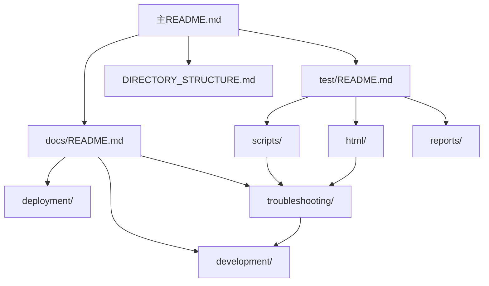

# 📁 目录结构重组说明

本文档记录了 CRDs Objects Browser 项目目录结构的重组过程和结果。

## 🎯 重组目标

1. **📚 文档集中管理** - 将所有文档按功能分类组织
2. **🧪 测试文件统一** - 将测试脚本和页面集中管理
3. **🔧 提高可维护性** - 建立清晰的目录层次结构
4. **📖 改善文档体验** - 提供完整的导航和说明

## 🔄 重组前后对比

### 重组前的问题
```
crds-objects-browser/
├── PERFORMANCE_OPTIMIZATION.md          # 散落在根目录
├── INFORMER_IMPLEMENTATION_SUMMARY.md   # 散落在根目录
├── PERFORMANCE_FIX_REPORT.md            # 散落在根目录
├── FRONTEND_FIX_REPORT.md               # 散落在根目录
├── QUICK_START_OPTIMIZATION.md          # 散落在根目录
├── VERSION_GUIDE.md                     # 散落在根目录
├── test-performance-fix.sh              # 散落在根目录
├── test-frontend-fix.html               # 散落在根目录
├── debug-frontend.html                  # 散落在根目录
├── debug.html                           # 散落在根目录
└── docs/
    ├── INFORMER_OPTIMIZATION.md         # 部分文档在docs中
    └── docker-tag-format.md             # 部分文档在docs中
```

**问题分析：**
- ❌ 文档散落在根目录，难以管理
- ❌ 测试文件混杂，缺乏组织
- ❌ 没有统一的文档导航
- ❌ 目录结构不清晰

### 重组后的结构
```
crds-objects-browser/
├── docs/                                # 📚 统一文档目录
│   ├── README.md                        # 文档导航
│   ├── development/                     # 🔧 开发文档
│   │   ├── PERFORMANCE_OPTIMIZATION.md
│   │   ├── INFORMER_IMPLEMENTATION_SUMMARY.md
│   │   └── INFORMER_OPTIMIZATION.md
│   ├── deployment/                      # 🚀 部署文档
│   │   ├── QUICK_START_OPTIMIZATION.md
│   │   ├── VERSION_GUIDE.md
│   │   └── docker-tag-format.md
│   └── troubleshooting/                 # 🔍 故障排除
│       ├── PERFORMANCE_FIX_REPORT.md
│       └── FRONTEND_FIX_REPORT.md
└── test/                                # 🧪 统一测试目录
    ├── README.md                        # 测试说明
    ├── scripts/                         # 测试脚本
    │   └── test-performance-fix.sh
    ├── html/                            # 测试页面
    │   ├── test-frontend-fix.html
    │   ├── debug-frontend.html
    │   └── debug.html
    └── reports/                         # 测试报告
```

**改进效果：**
- ✅ 文档按功能分类，便于查找
- ✅ 测试文件统一管理，结构清晰
- ✅ 提供完整的导航文档
- ✅ 目录层次分明，易于维护

## 📋 重组操作记录

### 1. 创建目录结构
```bash
mkdir -p docs/{development,deployment,troubleshooting}
mkdir -p test/{scripts,html,reports}
```

### 2. 移动文档文件
```bash
# 开发文档
mv PERFORMANCE_OPTIMIZATION.md docs/development/
mv INFORMER_IMPLEMENTATION_SUMMARY.md docs/development/
mv docs/INFORMER_OPTIMIZATION.md docs/development/

# 部署文档
mv QUICK_START_OPTIMIZATION.md docs/deployment/
mv VERSION_GUIDE.md docs/deployment/
mv docs/docker-tag-format.md docs/deployment/

# 故障排除文档
mv PERFORMANCE_FIX_REPORT.md docs/troubleshooting/
mv FRONTEND_FIX_REPORT.md docs/troubleshooting/
```

### 3. 移动测试文件
```bash
# 测试脚本
mv test-performance-fix.sh test/scripts/

# 测试页面
mv test-frontend-fix.html test/html/
mv debug-frontend.html test/html/
mv debug.html test/html/
```

### 4. 创建导航文档
- 创建 `docs/README.md` - 文档目录导航
- 创建 `test/README.md` - 测试目录说明
- 更新 `DIRECTORY_STRUCTURE.md` - 项目结构总览

### 5. 更新代码引用
- 更新 `pkg/api/server.go` 中的HTML文件路径
- 更新主 `README.md` 中的项目结构说明

## 🎯 分类标准

### 📚 文档分类 (docs/)

#### 🔧 开发文档 (development/)
- **目标用户**: 开发人员
- **内容类型**: 技术实现、架构设计、性能优化
- **文件特征**: 包含代码示例、技术细节、实现方案

#### 🚀 部署文档 (deployment/)
- **目标用户**: 运维人员、部署人员
- **内容类型**: 部署指南、配置说明、版本管理
- **文件特征**: 包含部署步骤、配置参数、环境要求

#### 🔍 故障排除 (troubleshooting/)
- **目标用户**: 所有用户
- **内容类型**: 问题诊断、修复报告、解决方案
- **文件特征**: 包含问题描述、解决步骤、验证方法

### 🧪 测试分类 (test/)

#### 🔧 测试脚本 (scripts/)
- **用途**: 自动化测试、性能验证
- **格式**: Shell脚本 (.sh)
- **特征**: 可执行、自动化、输出结果

#### 🌐 测试页面 (html/)
- **用途**: 前端测试、调试界面
- **格式**: HTML页面 (.html)
- **特征**: 交互式、可视化、实时监控

#### 📊 测试报告 (reports/)
- **用途**: 存放自动生成的测试报告
- **格式**: 各种格式的报告文件
- **特征**: 自动生成、历史记录、数据分析

## 🔗 文档间关联

### 交叉引用关系


### 链接更新
- 所有文档中的相对链接已更新
- 主README中的项目结构已更新
- 代码中的文件路径已更新

## 📈 改进效果

### 🎯 用户体验改进
1. **更容易找到文档** - 按功能分类，目录清晰
2. **更好的导航体验** - 提供完整的目录说明
3. **更快的问题解决** - 故障排除文档集中管理

### 🔧 开发体验改进
1. **更清晰的项目结构** - 文件组织有序
2. **更容易维护** - 相关文件集中管理
3. **更好的协作** - 统一的文档标准

### 📊 管理效率提升
1. **文档版本控制** - 统一管理，便于追踪
2. **测试流程标准化** - 测试文件集中，流程清晰
3. **知识管理优化** - 分类存储，便于检索

## 🚀 后续维护建议

### 📝 文档维护
1. **新增文档时** - 按分类放入对应目录
2. **更新文档时** - 同步更新相关链接
3. **定期检查** - 确保链接有效性

### 🧪 测试维护
1. **新增测试** - 按类型放入对应目录
2. **更新脚本** - 保持可执行性
3. **清理报告** - 定期清理旧报告

### 🔄 持续改进
1. **收集反馈** - 根据使用情况调整结构
2. **优化导航** - 改进文档间的关联
3. **标准化流程** - 建立文档和测试的标准流程

## 📋 检查清单

### ✅ 重组完成项
- [x] 创建docs和test目录结构
- [x] 移动所有文档文件到对应目录
- [x] 移动所有测试文件到对应目录
- [x] 创建目录导航文档
- [x] 更新代码中的文件路径引用
- [x] 更新主README的项目结构
- [x] 验证测试脚本正常工作
- [x] 清理根目录的临时文件

### 🔍 验证项
- [x] 所有文档链接正常
- [x] 测试脚本可正常执行
- [x] 服务器能正确访问HTML文件
- [x] 目录结构符合设计要求

这次目录重组大大提升了项目的组织性和可维护性，为后续的开发和维护工作奠定了良好的基础。 